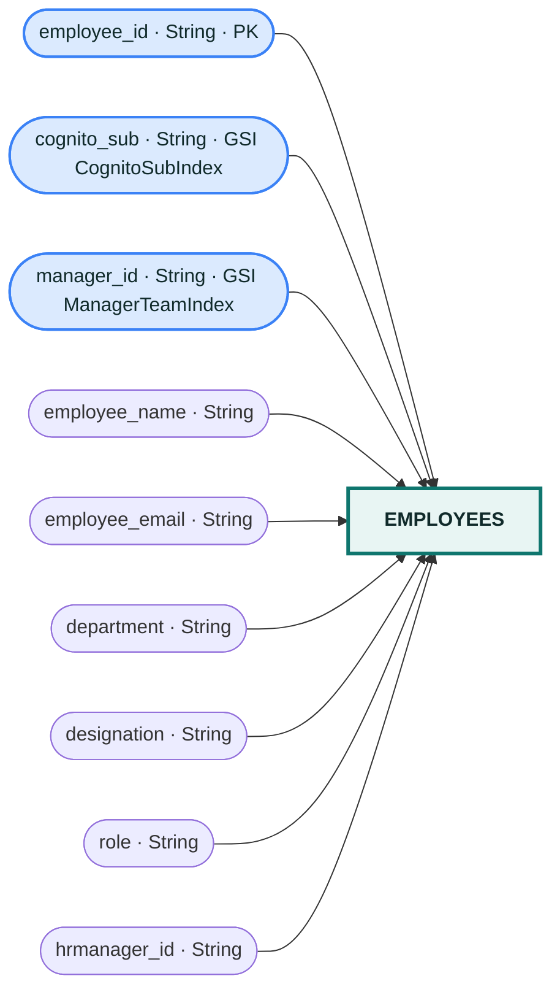

# `employees` table

```mermaid
flowchart LR
  employee_id([employee_id · String · PK]) --> employees[EMPLOYEES]
  cognito_sub([cognito_sub · String · GSI CognitoSubIndex]) --> employees
  manager_id([manager_id · String · GSI ManagerTeamIndex]) --> employees
  employee_name([employee_name · String]) --> employees
  employee_email([employee_email · String]) --> employees
  department([department · String]) --> employees
  designation([designation · String]) --> employees
  role([role · String]) --> employees
  hrmanager_id([hrmanager_id · String]) --> employees
  classDef entity fill:#e8f5f3,stroke:#0f766e,stroke-width:3px,color:#102a2a,font-weight:bold;
  classDef key fill:#dbeafe,stroke:#3b82f6,stroke-width:2px,color:#102a2a;
  class employees entity;
  class employee_id,cognito_sub,manager_id key;
```

`CognitoSubIndex` and `ManagerTeamIndex` were visible in the AWS Console. Confirm each index’s sort key and projection on the table’s **Indexes** tab.
