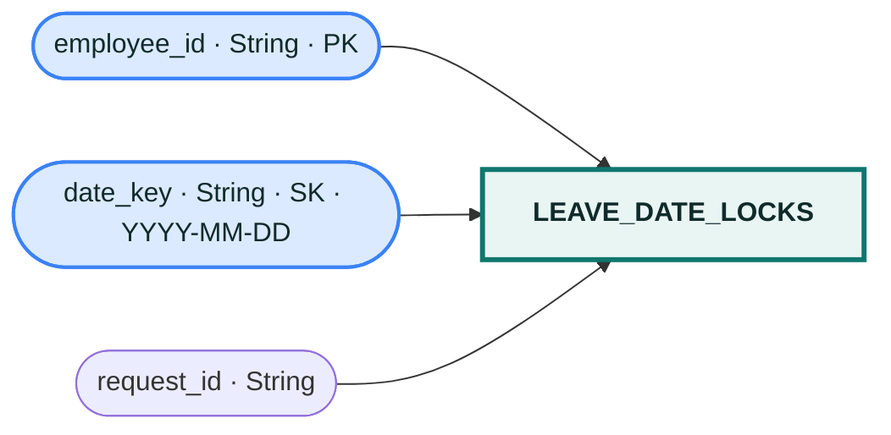

# `leave_date_locks` table

```mermaid
flowchart LR
  employee_id([employee_id · String · PK]) --> leave_date_locks[LEAVE_DATE_LOCKS]
  date_key([date_key · String · SK · YYYY-MM-DD]) --> leave_date_locks
  request_id([request_id · String]) --> leave_date_locks
  classDef entity fill:#e8f5f3,stroke:#0f766e,stroke-width:3px,color:#102a2a,font-weight:bold;
  classDef key fill:#dbeafe,stroke:#3b82f6,stroke-width:2px,color:#102a2a;
  class leave_date_locks entity;
  class employee_id,date_key key;
```

The backend uses one lock item per employee and working date to prevent concurrent overlapping requests. Remove the locks when a request is rejected or cancelled.
