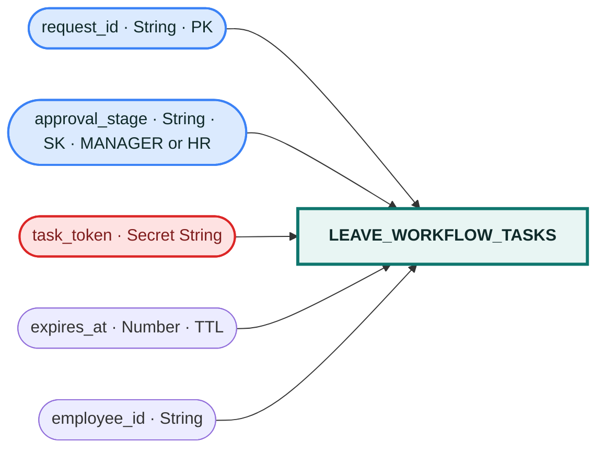

# `leave_workflow_tasks` table

```mermaid
flowchart LR
  request_id([request_id · String · PK]) --> workflow_tasks[LEAVE_WORKFLOW_TASKS]
  approval_stage([approval_stage · String · SK · MANAGER or HR]) --> workflow_tasks
  task_token([task_token · Secret String]) --> workflow_tasks
  expires_at([expires_at · Number · TTL]) --> workflow_tasks
  employee_id([employee_id · String]) --> workflow_tasks
  classDef entity fill:#e8f5f3,stroke:#0f766e,stroke-width:3px,color:#102a2a,font-weight:bold;
  classDef key fill:#dbeafe,stroke:#3b82f6,stroke-width:2px,color:#102a2a;
  classDef secret fill:#fee2e2,stroke:#dc2626,stroke-width:2px,color:#7f1d1d;
  class workflow_tasks entity;
  class request_id,approval_stage key;
  class task_token secret;
```

Enable DynamoDB TTL on `expires_at`. Never publish real callback-token values in source, screenshots, or logs.
